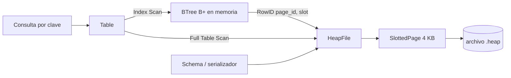
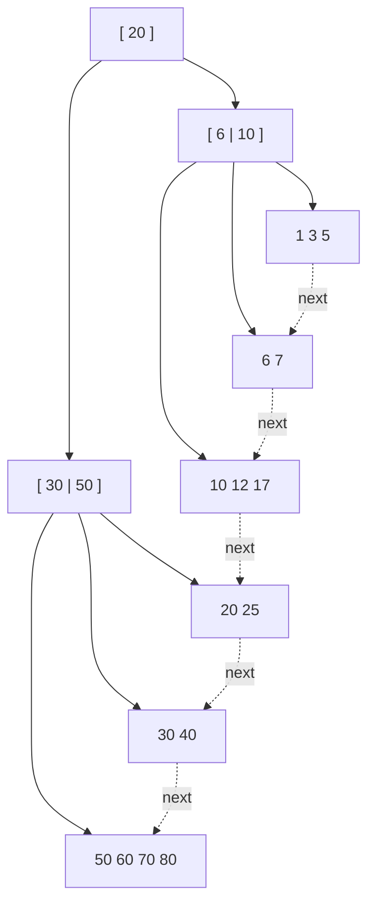
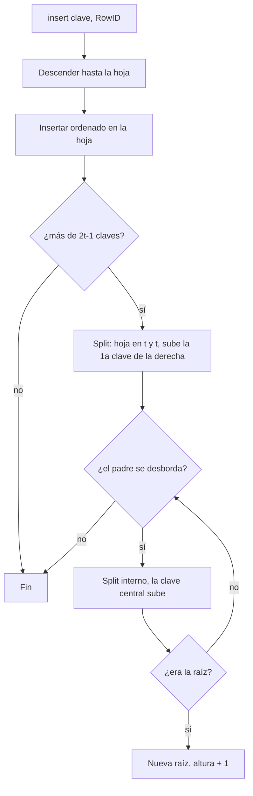

# Diseño técnico — Fase 1

## Formato de tupla
`INT` = 4 bytes big-endian con signo. `VARCHAR` = 2 bytes de longitud + bytes UTF-8.
Ejemplo: `(1, "ab")` → `00 00 00 01 | 00 02 | 61 62`.

## Página (4096 B) con directorio de slots
```
| num_slots(2) free_end(2) | slot0(off,len) slot1 ... |  espacio libre  | ... tupla1 tupla0 |
```
Los slots crecen hacia adelante y los datos hacia atrás. Un **RowID = (page_id, slot)**
identifica una tupla de forma única y estable.

## HeapFile
Archivo de páginas contiguas. Mantiene en memoria solo la última página (buffer de inserción);
toda lectura de otra página incrementa `reads`, lo que da la métrica de I/O del benchmark.

## Árbol B+ (grado mínimo t)
- Máx. 2t−1 claves por nodo; hojas ≥ t−1 claves; internos ≥ t hijos; raíz ≥ 2 hijos (o es hoja).
- Las hojas guardan `clave → RowID` y se enlazan en una lista (consultas por rango).
- **Split**: al superar 2t−1 claves, la hoja se parte en t | t y la primera clave de la derecha
  *sube copiada*; un nodo interno se parte con la clave central *subiendo movida*.
  Si la raíz se divide, la altura crece en 1.
- **Bulk load**: ordena, reparte las claves en hojas casi iguales (siempre cumplen el mínimo de
  ocupación) y construye los niveles superiores de abajo hacia arriba en O(n).
- `check_invariants()` verifica orden, ocupación, profundidad uniforme y enlaces de hojas;
  se usa en las pruebas.

## Diagramas

### Arquitectura


### Estructura del B+Tree (t = 2, máx. 3 claves por nodo)

_Esquema ilustrativo: los nodos internos guardan separadores y las hojas (enlazadas con `next`) guardan clave → RowID._

### Flujo de inserción con split


## Limitaciones conocidas (para mencionar o mejorar)
- El índice vive en memoria; solo el heap se guarda en disco. Para persistirlo habría que
  serializar los nodos a páginas.
- No hay `DELETE` ni `UPDATE` (fuera del alcance de la Fase 1: solo SELECT).
- Claves únicas; no hay índices secundarios con duplicados.
